# Introducción

Esta carpeta contiene los ficheros necesarios para generar el escenario para el proyecto, compuesto por 3 contenedores:

```mermaid
%% Versión en Español
flowchart LR
    

    subgraph E [Escenario]
        direction LR
        C(Cliente)
        A(Atacante)
        S(Servidor)

    end

    C --"📁"--> A --"📁*"--> S
    S --"📂"--> A --"📂*"--> C

    style E fill:#2496ED,stroke:white,stroke-width:2px
    style C fill:lime,stroke:black,color:black
    style A fill:black,stroke:red,color:red
    style S fill:green
```


> Servidor:
> ```
> usuario    : ftp
> contraseña : ftp
> ```

Tanto el **cliente** como el **servidor** tendrán el papel de intercambiar ficheros mediante **FTP**.  
El papel del **atacante** será capturar dichos ficheros **envenenando las tablas ARP** para no ser detectado.


# Guía de uso del *escenario*

## Instalar `docker` (Engine) y `docker-compose`

Se recomienda seguir la guía de la [documentación oficial](https://docs.docker.com/engine/install/) para solucionar posibles errores inesperados, falta de clave GPG...

```shell
sudo apt-get install docker-ce docker-ce-cli containerd.io docker-compse-plugin docker-compose
```
- Para comprobar que se instaló correctamente, puede ejecutarse: `sudo docker run hello-world`.

Activar el *daemon*:
```shell
sudo service docker start
```

## Comandos útiles

**Crear y/o arrancar el escenario**
```shell
sudo sh start.sh
```

Una vez termina el proceso, se accede al contenedor atacante (*attacker*) automáticamente.

Salida:
```
Starting attacker ... done
Starting server   ... done
Starting client   ... done
Name and IPs of containers:
        "Name": "docker_default",
                "Name": "attacker",
                "IPv4Address": "172.18.0.2/16",
                "Name": "client",
                "IPv4Address": "172.18.0.4/16",
                "Name": "server",
                "IPv4Address": "172.18.0.3/16",
Go to 'localhost:3000' to open wireshark
Go to 'localhost:5800' to open ftp client:
	host: ip of server
	Username and password: ftp
	Port: 21

Enter 'attacker' container...
```

### Docker

***Importante:** los datos varían tras cada creación del escenario.*

**Listar contenedores y su estado**
```shell
sudo docker ps
```

Salida:
```
CONTAINER ID   IMAGE                       COMMAND              CREATED          STATUS          PORTS                                                                                              NAMES
885bb7c4237e   wshark                      "/init"              26 minutes ago   Up 26 minutes   0.0.0.0:3000->3000/tcp, :::3000->3000/tcp, 3389/tcp                                                attacker
34ba69126762   jlesage/filezilla:v1.35.3   "/init"              26 minutes ago   Up 26 minutes   0.0.0.0:5800->5800/tcp, :::5800->5800/tcp, 5900/tcp                                                client
e4ab55bf6b02   panubo/vsftpd:v1.0.0        "/entry.sh vsftpd"   26 minutes ago   Up 26 minutes   0.0.0.0:21->21/tcp, :::21->21/tcp, 0.0.0.0:4559-4564->4559-4564/tcp, :::4559-4564->4559-4564/tcp   server
```

**Listar las redes**
```shell
sudo docker network ls
```

Salida:
```
NETWORK ID     NAME             DRIVER    SCOPE
117e986308ae   bridge           bridge    local
300435190c98   docker_default   bridge    local
b9e92686dde5   host             host      local
65e0ab10dc42   none             null      local
```

**Obtener las IPs de los contenedores dentro de su red**
```shell
docker network inspect docker_default
```

Salida:
```
(...)

"ConfigOnly": false,
"Containers": {
    "34ba69126762fff0f3690c99309fe96f78890d9dcaadcc64eed824394c7735eb": {
        "Name": "client",
        "EndpointID": "3e75d99d7c4f49d9a80c30d0376ede5b19ab19eef4bcdd4069ded387483da598",
        "MacAddress": "02:42:ac:12:00:03",
        "IPv4Address": "172.18.0.3/16",
        "IPv6Address": ""
    },
    "885bb7c4237e6b04e000b9fd1774643e0b0002813ab5f039e3f711acaf3d1586": {
        "Name": "attacker",
        "EndpointID": "44b1599e6a732a55912f1f38cdeb47b0e9e4f5d6ee2f4165ba8689c4c235711f",
        "MacAddress": "02:42:ac:12:00:02",
        "IPv4Address": "172.18.0.2/16",
        "IPv6Address": ""
    },
    "e4ab55bf6b02d4e05da8e37adb480397731fe5775871fc5461ac8d52f1775309": {
        "Name": "server",
        "EndpointID": "476cce781c9f88e166fba3cbeeb225c8192457f573927b040f37fdcdfa457f33",
        "MacAddress": "02:42:ac:12:00:04",
        "IPv4Address": "172.18.0.4/16",
        "IPv6Address": ""
    }

(...)
```

### TCP

Usando el comando `tcpdump`.

**Escuchar el tráfico (sin resolver las IPs)**
```shell
tcpdump -n
```

**Escuchar el tráfico (sin resolver las IPs y solo ARP)**
```shell
tcpdump -ni eth0 arp
```

Salida:
```
tcpdump: verbose output suppressed, use -v or -vv for full protocol decode
listening on eth0, link-type EN10MB (Ethernet), capture size 262144 bytes
09:07:59.140598 ARP, Request who-has 172.18.0.4 tell 172.18.0.1, length 28
09:07:59.140612 ARP, Reply 172.18.0.4 is-at 02:42:ac:12:00:04, length 28
^C
2 packets captured
2 packets received by filter
0 packets dropped by kernel
```

**Listar las interfaces**
```shell
tcpdump -D
```

Salida:
```
1.eth0 [Up, Running]
2.any (Pseudo-device that captures on all interfaces) [Up, Running]
3.lo [Up, Running, Loopback]
4.nflog (Linux netfilter log (NFLOG) interface)
5.nfqueue (Linux netfilter queue (NFQUEUE) interface)
6.usbmon1 (USB bus number 1)
7.usbmon2 (USB bus number 2)
8.usbmon3 (USB bus number 3)
9.usbmon4 (USB bus number 4)
```

### ARP

Usando el comando `arp` (pertenenciente al paquete `net-tools`).

**Ver tabla ARP (sin resolver las IPs)**
```shell
arp -n
```

Salida:
```
Address                  HWtype  HWaddress           Flags Mask            Iface
172.18.0.1               ether   02:42:be:1c:fc:f5   C                     eth0
```
- Usar el comando `ping` aumenta la tabla ARP.

**Enviar paquetes ARP**
```shell
arping <IP>
```

Salida (para `IP = 172.18.0.3`):
```
ARPING 172.18.0.3
42 bytes from 02:42:ac:12:00:03 (172.18.0.3): index=0 time=14.948 msec
42 bytes from 02:42:ac:12:00:03 (172.18.0.3): index=1 time=5.679 msec
^C
--- 172.18.0.3 statistics ---
2 packets transmitted, 2 packets received,   0% unanswered (0 extra)
rtt min/avg/max/std-dev = 5.679/10.313/14.948/4.635 ms
```
- Usar este comando no aumenta la tabla ARP.

